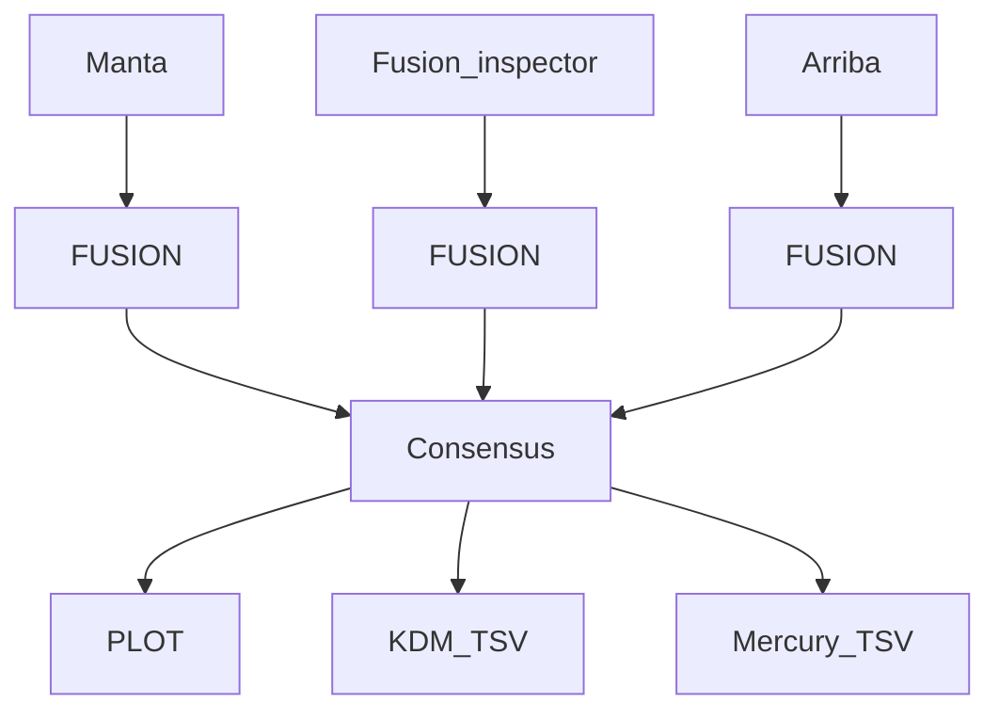

# OA_Structural_Variants
⚠ This only handle fusion at the moment

## Presentation and motivation
Aims of this library is to present an uniq structural variants format to handle 
multiple tool format.
Therefore, each output tool should be converted in standard oncodna structural variants format.


## Git repository
http://gitlab.oncoworkers.oncodna.com/bioinfo/libraries/structural_variants

## Installation

`pip install oa_structural_variants`
`pip install http://gitlab.oncoworkers.oncodna.com/bioinfo/libraries/structural_variants.git`

## Usage

```python
from oa_structural_variants.fusion import Fusion, Partner, Partners
## Create fusion object
fusion = Fusion(
    partners=Partners(
        left=Partner(
            direction="upstream",
            chr="chr1",
            position=10,
        ),
        right=Partner(
            direction="downstream",
            chr="chr1",
            position=10,
        )
    )
)

## Export fusion object
from oa_structural_variants.utils import save_sv_to_json

save_sv_to_json(json_path="path_to_output", svs=[fusion])

## Import fusion object
from oa_structural_variants.utils import load_sv_from_json

fusions = load_sv_from_json(json_path="path_to_input")
```