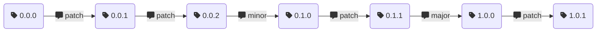

Thinly scoped and opinionated tool that computes a version number from git tags
and trailers

--------------------------------------------------------------------------------

Python3.8+ CLI that computes a version number `MAJOR.MINOR.PATCH` based on git
tags and commit trailers.

Every project starts at `0.0.0`.
By default, every commit increments the `RELEASE` portion of the version.

In any commit, one may include a trailer of the form::

```
ci-version-bump: {patch,minor,major}
```


The version number will be incremented accordingly.

As an example:


